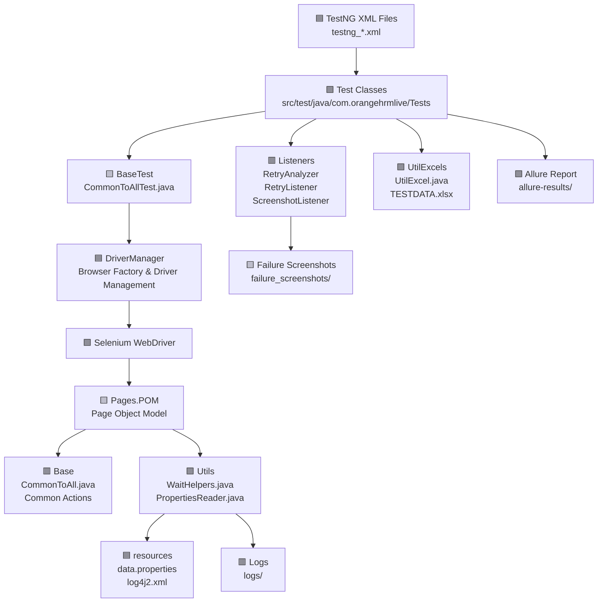

# Selenium Automation Framework (with Java)

#### **Author** - Sudarshan Patil

---

# 🚀 Features

* Java, Selenium, TestNG
* Maven, AssertJ, POM
* Allure Report
* Excel Sheet for Test Data → Data Provider
* Read the username and password from Properties
* TestNG, @Test, Before and After Method

---

# 📁 Project Structure

```text
OrangeHRMAdvancedFramework/
├── src/
│   ├── main/
│   │   ├── java/com/orangehrmlive/
│   │   │   ├── base/
│   │   │   │   └── CommonToAll.java          # Base class with common actions
│   │   │   ├── driver/
│   │   │   │   └── DriverManager.java        # Browser factory & driver management
│   │   │   ├── pages/
│   │   │   │   ├── POM/                      # Page Object Model implementations
│   │   │   │   │   ├── OrangeHRM/
│   │   │   └── utils/
│   │   │       ├── PropertiesReader.java     # Configuration reader
│   │   │       └── WaitHelpers.java          # Wait utility methods
│   │   └── resources/
│   │       ├── data.properties               # Test configuration
│   │       └── log4j2.xml                    # Logging configuration
│   └── test/
│       ├── java/com/orangehrmlive/
│       │   ├── baseTest/
│       │   │   └── CommonToAllTest.java      # Base test with setup/teardown
│       │   ├── listeners/
│       │   │   ├── RetryAnalyzer.java        # Test retry logic
│       │   │   ├── RetryListener.java        # Retry annotation transformer
│       │   │   └── ScreenshotListener.java   # Failure screenshot capture
│       │   ├── tests/
│       │   │   ├── OrangeHRM/                      # OHR application tests
│       │   └── utilExcels/
│       │       └── UtilExcel.java            # Excel data reader
│       └── resources/
│           └── TESTDATA.xlsx                 # Test data file
├── allure-results/                           # Allure report data
├── failure_screenshots/                       # Failed test screenshots
├── logs/                                      # Application logs
├── pom.xml                                   # Maven configuration
└── testng_*.xml                              # TestNG suite files
```

# 🎯 OOP Concepts Used in This Framework

## 1. Encapsulation 🔒

Encapsulation is used to hide the internal state and require all interaction to be performed through object methods.

| Class            | Implementation                                                              |
| ---------------- | --------------------------------------------------------------------------- |
| DriverManager    | WebDriver instance is encapsulated with getDriver() and setDriver() methods |
| LoginPage        | Page locators are private and accessed only through public action methods   |
| PropertiesReader | File handling logic is encapsulated within readKey() method                 |
| UtilExcel        | Excel workbook and sheet objects are static with controlled access          |

```java
// Example from DriverManager.java
public static WebDriver driver;  // State

public static WebDriver getDriver() { 
    return driver; 
}

public static void setDriver(WebDriver driver) { 
    DriverManager.driver = driver; 
}
```

---

## 2. Inheritance 👪

Inheritance is used to create a hierarchy where child classes inherit properties and methods from parent classes.

| Parent Class           | Child Class                                 | Purpose                                             |
| ---------------------- |---------------------------------------------| --------------------------------------------------- |
| CommonToAll            | LoginPage, AdminPage, DashboardPage,<br/>PIMPage | Page Object Model pages inherit common actions      |
| CommonToAllTest        | All Test Classes                            | Test classes inherit @BeforeMethod and @AfterMethod |
| IRetryAnalyzer         | RetryAnalyzer                               | Implements retry logic interface                    |
| ITestListener          | ScreenshotListener                          | Implements test listener interface                  |
| IAnnotationTransformer | RetryListener                               | Implements annotation transformer                   |

```java
// Example: Test class inheriting base test
public class Test01_OHR_Invalid_Login extends CommonToAllTest {
// Inherits setUp() and tearDown() methods
}

// Example: Page Object Model class inheriting CommonToAll
public class LoginPage extends CommonToAllPage {
// Inherits openOHRURL(), clickElement(), enterInput(), getText()
}
```

---

## 3. Polymorphism 🔄

Polymorphism allows methods to behave differently based on the object/parameters.

### Method Overloading (Compile-time Polymorphism)

| Class       | Overloaded Methods                                                   |
| ----------- | -------------------------------------------------------------------- |
| CommonToAll | clickElement(By by), clickElement(WebElement by)                     |
| CommonToAll | enterInput(By by, String key), enterInput(WebElement by, String key) |
| CommonToAll | getText(By by), getText(WebElement by)                               |
| WaitHelpers | checkVisibility(WebDriver, By, int), checkVisibility(WebDriver, By)  |

```java
// Method Overloading in CommonToAll.java
public void clickElement(By by) {
getDriver().findElement(by).click();
}

public void clickElement(WebElement by) {
by.click();
}
```

### Method Overriding (Runtime Polymorphism)

| Interface              | Implementation     | Overridden Method                 |
| ---------------------- | ------------------ | --------------------------------- |
| IRetryAnalyzer         | RetryAnalyzer      | retry(ITestResult result)         |
| ITestListener          | ScreenshotListener | onTestFailure(ITestResult result) |
| IAnnotationTransformer | RetryListener      | transform(...)                    |

```java
// Method Overriding in RetryAnalyzer.java
@Override
public boolean retry(ITestResult result) {
if (retryCount < maxRetryCount) {
retryCount++;
return true;
}
return false;
}
```

---

## 4. Abstraction 🎭

Abstraction hides complex implementation details and exposes only the essential features.

| Abstraction Type         | Implementation                                            |
| ------------------------ | --------------------------------------------------------- |
| Interface Implementation | IRetryAnalyzer, ITestListener, IAnnotationTransformer     |
| Page Object Pattern      | Test classes don't know about locators, only page actions |
| Utility Classes          | WaitHelpers, PropertiesReader hide complex logic          |

```java
// Abstraction through Page Object Model
// Test class only knows about logintoInvalidCreds() method
// It doesn't know about internal locators or implementation

LoginPage loginPage = new LoginPage(DriverManager.getDriver());

String error_msg = loginPage.logintoInvalidCreds(
PropertiesReader.readKey("invalid_username"),
PropertiesReader.readKey("invalid_password")
);
```

---

## 5. Composition 🧩

Composition is used where classes contain instances of other classes.

| Container Class    | Composed Object  | Purpose                                 |
| ------------------ | ---------------- | --------------------------------------- |
| LoginPage          | WebDriver driver | Page uses driver for browser operations |
| ScreenshotListener | WebDriver        | Listener uses driver for screenshots    |

```java
// Composition in LoginPage.java
public class LoginPage {

WebDriver driver;  // Composed object

    public LoginPage(WebDriver driver) {
        this.driver = driver;  // Dependency injection
    }
}
```

---

## 6. Static Members ⚡

Static members are used for shared resources and utility methods.

| Class            | Static Usage                                     |
| ---------------- | ------------------------------------------------ |
| DriverManager    | static WebDriver driver - Shared across tests    |
| PropertiesReader | static String readKey() - Utility method         |
| WaitHelpers      | All methods are static - Utility class           |
| UtilExcel        | static Workbook, static Sheet - Shared resources |

---

## 7. Constructor Overloading & Dependency Injection 💉

Constructors are used to inject dependencies into page objects.

```java
// Constructor injection in LoginPage.java
public LoginPage(WebDriver driver) {
this.driver = driver;
}
```

---

# 📐 Design Patterns Used

| Pattern                 | Implementation       | Purpose                                   |
| ----------------------- | -------------------- | ----------------------------------------- |
| Page Object Model (POM) | pages/POM/*          | Separates page elements from test logic   |
| Singleton-like          | DriverManager        | Single point of driver management         |
| Factory Pattern         | DriverManager.init() | Creates browser instances based on config |
| Listener Pattern        | TestNG Listeners     | Event-driven test execution hooks         |

---

# 📦 Dependencies

| Dependency    | Version | Purpose               |
| ------------- | ------- | --------------------- |
| Selenium Java | 4.44.0  | Browser automation    |
| TestNG        | 7.12.0  | Test framework        |
| AssertJ       | 4.0.0   | Fluent assertions     |
| Allure TestNG | 2.35.1  | Test reporting        |
| Log4j         | 2.23.1  | Logging               |
| Apache POI    | 5.3.0   | Excel file handling   |
| Dotenv Java   | 3.0.0   | Environment variables |
| SnakeYAML     | 2.2     | YAML parsing          |

---

# 📊 Framework Flow Diagram


